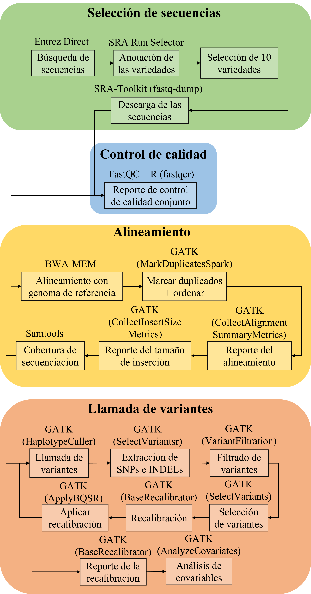
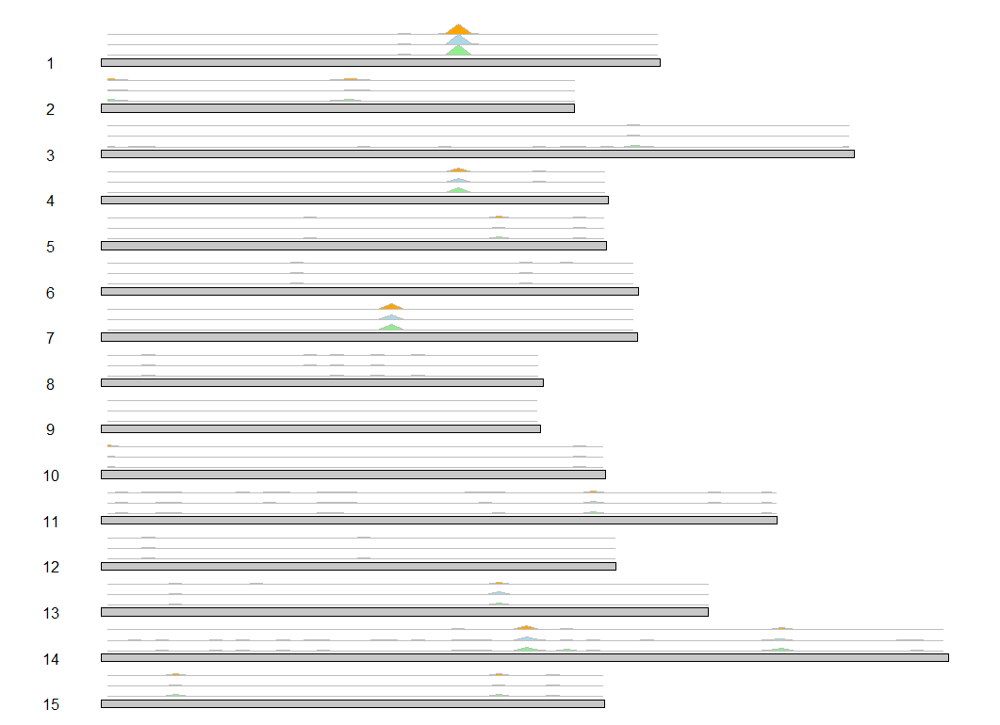
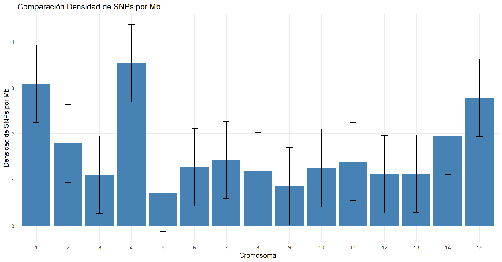

# Introducción al repositorio

Este repositorio contiene scripts en Bash y otros recursos asociados a
mi trabajo final de máster en Bioinformática y Bioestadística de la UOC.
El objetivo principal de este trabajo es encontrar marcadores
moleculares, en este caso polimorfismos de un solo nucleótido (SNPs),
que sean capaces de identifcar con precisión variedades comerciales de
la especie *Pistacia vera*.

Los scripts aquí presentes automatizan gran parte de los procesos
necesarios para la obtención de los SNPs. El primero de ellos, abarca la
llamada de variantes pero hay tres fases previas que consisten en la
**selección de secuencias**, el **control de calidad** y el
**alineamiento**. Todos los pasos se detallan en la siguiente figura:



A continuación se van a detallar las diferentes fases y procesos
utilizados para conseguir un panel de SNPs de diferentes variedades e
incluso su anotación funcional.

# Selección de secuencias

La búsqueda de secuencias inicial se realizó con Entrez Direct
[@kans2024] con el siguiente comando:

```{bash eval=FALSE}
esearch -db sra -query "Pistacia vera[Organism] AND WGS[Strategy] AND paired[Layout] AND Illumina[Platform]" | \
efetch -format runinfo > pistacia_vera_genomic_dna_illumina_paired.csv
```

Con esto se genera un archivo CSV con los metadatos asociados a las
colecciones de secuencias que cumplen las condiciones de ser
pertenecientes a la especie *Pistacia vera*, que la secuenciación haya
sido del genoma completo de tipo *paired-end* y de la plataforma
Illumina. Todo esto se guarda en un archivo CSV que arrojó un total de
121 colecciones de secuencias.

Como nuestro interés es averiguar el tipo de variedad asociado a cada
colección, usando los números de acceso de la columna Run y la utilidad
de NCBI [@sayers2022] SRA Run Selector se puede conseguir dicha
información.

Tras esto se seleccionaron colecciones de secuencias d 6 variedades
hembras y se añadieron 4 variedades macho propias de la universidad de
Granada. Las variedades hembras se descargaron mediante el siguiente
comando:

```{bash eval=FALSE}
fastq-dump #numero_acceso

```

# Control de calidad

Las para ver si había problemas de secuenciación, se utilizó FastQC
[@fastqc2015] y el paquete de R FastQCR [@fastqcr] para agrupar los
reportes:

```{r eval=FALSE}
qc.dir <-  #Ruta a los reportes de FastQC .zip
qc <- qc_aggregate(qc.dir)
qc_fails(qc, "module")
qc_fails(qc, "sample")
qc_report(qc.dir, result.file = "multi-qc-report-all.html")

```

El resultado se puede ver
[aquí](https://aarongs1999.github.io/repositorio_tfm_uoc/reports/multi-qc-report-all.html.html).

# Alineamiento y llamada de variantes

Para este paso, en nuestro caso para optimizar el uso de recursos
informáticos se untilizó el servidor europeo de Galaxy [@afgan2018].
Para ello se utilizaron las colecciones de secuencias para alinearlas
frente al genoma de referencia de la variedad
[Bagyolu](https://www.ncbi.nlm.nih.gov/datasets/genome/GCA_026535395.1/)
mediante BWA-MEM [@li2013]. El resto de pasos que se puede ver en la
figura del workflow se realizaron en una imagen de GATK [@mckenna2010]
corriendo en un contenedor de docker en un servidor linux cedido por el
grupo de investigación BIO-200 de Genética Molecular de la universidad
de Granada. Entonces, el siguiente script abarca desde este punto hasta
todo el proceso de llamada de variantes y se realiza a partir de los
archivos de alineamiento .bam generados en Galaxy y el genoma de
referencia:

```{bash eval=FALSE}
#!/bin/bash

# alineamientos (Picard style y .bam)
BAM_FILES=("")

#configuración
REFERENCE= #Genoma de referencia en fasta
TMP_DIR= # Directorio para almacenar archivos temporales
THREADS= # Nº de hilos de CPU
MEMORY= # Cantidad de memoria RAM

samtools faidx $REFERENCE

for FILE in "${BAM_FILES[@]}"
do
  # Marcar duplicados y ordenar
  gatk MarkDuplicatesSpark --java-options "-Xmx$MEMORY -Djava.io.tmpdir=$TMP_DIR -XX:ParallelGCThreads=$THREADS" \
      -I $FILE \
      -O ${FILE%.bam}_sorted_dedup.bam \
      -M ${FILE%.bam}_dedup_metrics.txt
  
  # Métricas de alineamiento
  gatk CollectAlignmentSummaryMetrics --java-options "-Xmx$MEMORY -Djava.io.tmpdir=$TMP_DIR -XX:ParallelGCThreads=$THREADS" \
      -R $REFERENCE \
      -I ${FILE%.bam}_sorted_dedup.bam \
      -O ${FILE%.bam}_alignment_metrics.txt

  # Métricas del tamaño de inserción
  gatk CollectInsertSizeMetrics --java-options "-Xmx$MEMORY -Djava.io.tmpdir=$TMP_DIR -XX:ParallelGCThreads=$THREADS" \
      -I ${FILE%.bam}_sorted_dedup.bam \
      -O ${FILE%.bam}_insert_metrics.txt \
      -H ${FILE%.bam}_insert_size_histogram.pdf
  
  # Variant calling con HaplotypeCaller
  gatk HaplotypeCaller --java-options "-Xmx$MEMORY -Djava.io.tmpdir=$TMP_DIR -XX:ParallelGCThreads=$THREADS" \
      -R $REFERENCE \
      -I ${FILE%.bam}_sorted_dedup.bam \
      -O ${FILE%.bam}_raw_variants.vcf

  # Extracción de SNPs e INDELs
  gatk SelectVariants -R $REFERENCE -V ${FILE%.bam}_raw_variants.vcf \
      -select-type SNP -O ${FILE%.bam}_raw_snps.vcf
  gatk SelectVariants -R $REFERENCE -V ${FILE%.bam}_raw_variants.vcf \
      -select-type INDEL -O ${FILE%.bam}_raw_indels.vcf

  # Filtrado de SNPs
  gatk VariantFiltration --java-options "-Xmx$MEMORY -Djava.io.tmpdir=$TMP_DIR -XX:ParallelGCThreads=$THREADS" \
      -R $REFERENCE -V ${FILE%.bam}_raw_snps.vcf \
      -O ${FILE%.bam}_filtered_snps.vcf \
      -filter-name "Depth" -filter "DP < 10" \
      -filter-name "Freq" -filter "AF < 0.35" \
      -filter-name "QD_filter" -filter "QD < 2.0" \
      -filter-name "FS_filter" -filter "FS > 60.0" \
      -filter-name "MQ_filter" -filter "MQ < 40.0" \
      -filter-name "SOR_filter" -filter "SOR > 4.0" \
      -filter-name "MQRankSum_filter" -filter "MQRankSum < -12.5" \
      -filter-name "ReadPosRankSum_filter" -filter "ReadPosRankSum < -8.0"

  # Filtrado de INDELs
  gatk VariantFiltration --java-options "-Xmx$MEMORY -Djava.io.tmpdir=$TMP_DIR -XX:ParallelGCThreads=$THREADS" \
      -R $REFERENCE -V ${FILE%.bam}_raw_indels.vcf \
      -O ${FILE%.bam}_filtered_indels.vcf \
      -filter-name "Depth" -filter "DP < 10" \
      -filter-name "Freq" -filter "AF < 0.35" \
      -filter-name "QD_filter" -filter "QD < 2.0" \
      -filter-name "FS_filter" -filter "FS > 200.0" \
      -filter-name "SOR_filter" -filter "SOR > 10.0"

  # Selección de SNPs e INDELs filtrados para BQSR
  gatk SelectVariants --exclude-filtered \
      -V ${FILE%.bam}_filtered_snps.vcf \
      -O ${FILE%.bam}_bqsr_snps.vcf
  gatk SelectVariants --exclude-filtered \
      -V ${FILE%.bam}_filtered_indels.vcf \
      -O ${FILE%.bam}_bqsr_indels.vcf

  # Recalibración de calidad de bases
  gatk BaseRecalibrator -R $REFERENCE -I ${FILE%.bam}_sorted_dedup.bam \
      --known-sites ${FILE%.bam}_bqsr_snps.vcf \
      --known-sites ${FILE%.bam}_bqsr_indels.vcf \
      -O ${FILE%.bam}_recal_data.table
  gatk ApplyBQSR -R $REFERENCE -I ${FILE%.bam}_sorted_dedup.bam \
      -bqsr ${FILE%.bam}_recal_data.table \
      -O ${FILE%.bam}_recal_reads.bam

  # Variant calling post-recalibración
  gatk HaplotypeCaller --java-options "-Xmx$MEMORY -Djava.io.tmpdir=$TMP_DIR -XX:ParallelGCThreads=$THREADS" \
      -R $REFERENCE \
      -I ${FILE%.bam}_recal_reads.bam \
      -O ${FILE%.bam}_raw_variants_recal.vcf

  # Extracción de SNPs e INDELs recalibrados
  gatk SelectVariants -R $REFERENCE -V ${FILE%.bam}_raw_variants_recal.vcf \
      -select-type SNP -O ${FILE%.bam}_raw_snps_recal.vcf
  gatk SelectVariants -R $REFERENCE -V ${FILE%.bam}_raw_variants_recal.vcf \
      -select-type INDEL -O ${FILE%.bam}_raw_indels_recal.vcf

  # Filtrado de SNPs e INDELs recalibrados
  gatk VariantFiltration --java-options "-Xmx$MEMORY -Djava.io.tmpdir=$TMP_DIR -XX:ParallelGCThreads=$THREADS" \
      -R $REFERENCE -V ${FILE%.bam}_raw_snps_recal.vcf \
      -O ${FILE%.bam}_filtered_snps_final.vcf \
      -filter-name "Depth" -filter "DP < 10" \
      -filter-name "Freq" -filter "AF < 0.01" \

  gatk VariantFiltration --java-options "-Xmx$MEMORY -Djava.io.tmpdir=$TMP_DIR -XX:ParallelGCThreads=$THREADS" \
      -R $REFERENCE -V ${FILE%.bam}_raw_indels_recal.vcf \
      -O ${FILE%.bam}_filtered_indels_final.vcf \
      -filter-name "QD_filter" -filter "QD < 2.0" \
      -filter-name "FS_filter" -filter "FS > 200.0" \
      -filter-name "SOR_filter" -filter "SOR > 10.0"
done

```

# Filtrado de SNPs 1

Los filtros aplicados en el script anterior agregan una etiqueta a los
SNPs que pasan o no pasan el filtro. Para limpiar los archivos de SNPs
generados para cada variante se utilizó el siguiente código que utiliza
bcftools [@danecek2021]:

```{bash eval=FALSE}
#!/bin/bash

# Alineamientos (Picard style y .bam)
# Solo necesrio para los nombres de los archivos
BAM_FILES=("")

# Procesamiento de cada archivo
for FILE in "${BAM_FILES[@]}"
do
  # Filtrar variantes con bcftools (solo aquellas con FILTER = PASS)
  bcftools view -f PASS ${FILE%.bam}_filtered_snps_final.vcf -o ${FILE%.bam}_filtered_snps_clean.vcf
done

```

# Extracción de SNPs únicos

Puesto que para cumplir los objetivos se requiere de un panel de SNPs
que identifiquen a cada variedad, se va a extraer los SNPs que solo
están presentes en cada una de las variedades y para ello se utilizó el
siguiente Script que aprovecha la funcionalidad isec de bcftools:

```{bash eval=FALSE}
#!/bin/bash

# Crear la carpeta 'unicos' si no existe
mkdir -p unicos

# Comprimir todos los archivos .vcf a .vcf.gz si no están comprimidos
for file in *_filtered_snps_clean.vcf; do
    if [[ -f "$file" ]]; then
        bgzip -c "$file" > "$file.gz"
    fi
done

# Crear índices .tbi para todos los archivos .vcf.gz
for file in *.vcf.gz; do
    if [[ -f "$file" ]]; then
        tabix -p vcf "$file"
    fi
done

# Obtener una lista de archivos comprimidos y el total de archivos
compressed_files=(*_filtered_snps_clean.vcf.gz)
num_files=${#compressed_files[@]}

# Ejecutar bcftools isec con -w desde 1 hasta num_files y guardar los SNPs únicos en 'unicos'
for ((i=1; i<=num_files; i++)); do
    output_name="unicos/$(basename "${compressed_files[$i-1]}" .vcf.gz)_filtered_snps_clean.vcf.gz"
    bcftools isec -n=1 -w"$i" "${compressed_files[@]}" | bgzip -c > "$output_name"
done
```

# Filtrado de SNPs 2

Es posible que detectados como SNPs exclusivos de cada variedad no lo
sean debido al azar. Podría ocurrir que una determinada posición no haya
sido secuenciada y por lo tanto, no habría aparecido en los
alineamientos de las variedades. Para lidiar con ese problema, se
realizó un script que comprueba la profundidad de secuenciación de cada
posición de todos los SNPs en cada alineamiento. Esto se realizó fijando
una cobertura mínima de 10, 50 y 100 para posteriormente ver la cantidad
de SNPs resultantes:

```{bash eval=FALSE}
#!/bin/bash

# Directorios
ALIGNMENTS_DIR= # Ruta a los alineamientos
SNPS_DIR= # Ruta a los archivos .vcf a filtrar
OUTPUT_DIR_BASE= # Ruta donde se almacenarán los resultados

# Archivos
ALIGNMENTS=(${ALIGNMENTS_DIR}/*.bam)  # Obtiene todos los archivos .bam
SNPS_FILES=(${SNPS_DIR}/*_filtered_snps_clean_filtered_snps_clean.vcf.gz)

# Profundidades a analizar
DEPTHS=(10 50 100)

# Iterar sobre las profundidades
for DEPTH in "${DEPTHS[@]}"; do

  # Directorio de salida para la profundidad actual
  OUTPUT_DIR="${OUTPUT_DIR_BASE}/DP${DEPTH}"

  # Crear directorio de salida si no existe
  mkdir -p $OUTPUT_DIR

  # Paso 0: Crear índices para archivos VCF.gz si no existen
  for vcf in "${SNPS_FILES[@]}"; do
    if [ ! -f "${vcf}.csi" ]; then
      echo "Generando índice para $vcf..."
      bcftools index -c $vcf
    fi
  done

  # Paso 1: Combinar SNPs de todas las variedades en un archivo BED
  ALL_SNPS_BED=${OUTPUT_DIR}/all_snps_unique.bed
  > $ALL_SNPS_BED

  for vcf in "${SNPS_FILES[@]}"; do
    bcftools query -f '%CHROM\t%POS0\t%POS\n' $vcf >> $ALL_SNPS_BED
  done

  # Eliminar duplicados en el archivo BED
  sort -u $ALL_SNPS_BED > $ALL_SNPS_BED.tmp && mv $ALL_SNPS_BED.tmp $ALL_SNPS_BED

  # Paso 2: Calcular la profundidad combinada
  COMBINED_DEPTH=${OUTPUT_DIR}/combined_depth.txt
  samtools depth -a -b $ALL_SNPS_BED "${ALIGNMENTS[@]}" > $COMBINED_DEPTH

  # Paso 3: Filtrar posiciones con profundidad >= DEPTH en todas las variedades
  VALID_POSITIONS_BED=${OUTPUT_DIR}/valid_positions.bed
  awk -v depth=$DEPTH '{
    valid=1; 
    for (i=3; i<=NF; i++) {
      if ($i < depth) {
        valid=0; 
        break;
      }
    }
    if (valid) print $1 "\t" $2 "\t" $2+1
  }' $COMBINED_DEPTH > $VALID_POSITIONS_BED

  # Paso 4: Filtrar SNPs en cada archivo VCF
  for vcf in "${SNPS_FILES[@]}"; do
    BASENAME=$(basename $vcf .vcf.gz)
    OUTPUT_VCF=${OUTPUT_DIR}/${BASENAME}_filtered.vcf.gz
    bcftools view -R $VALID_POSITIONS_BED $vcf -o $OUTPUT_VCF -O z
  done

  echo "Filtrado completado para profundidad $DEPTH. Archivos generados en $OUTPUT_DIR"

done
```

Tras esto decidimos quedarnos con la profundiad 100 dado que obtuvimos
un número de SNPs suficientes.

# Estudio de la distribución de los SNPs

Para esto se utilizó la librería de R [@karyoploteR] y los archivos .bed
de posiciones validadas que se generan en el apartado anterior:

\# SNPs -\> GRanges

```{r eval=FALSE}
library(karyoploteR)
library(GenomicRanges)

# cromosomas
cromosomas <- read.table(text = "
id	chromosome 	length(pb)
CM048778.1	1	41445905
CM048779.1	2	35111735
CM048780.1	3	55874636
CM048781.1	4	37637094
CM048782.1	5	37450664
CM048783.1	6	39830480
CM048784.1	7	39797145
CM048785.1	8	32774349
CM048786.1	9	32571006
CM048787.1	10	37402841
CM048788.1	11	50110595
CM048789.1	12	38139874
CM048790.1	13	45017634
CM048791.1	14	62820281
CM048792.1	15	37340759
", header = TRUE)

# data frame para karyoploteR
cromosomas_karyoploteR <- data.frame(
  chr = cromosomas$chromosome,
  start = 1,
  end = cromosomas$length.pb)

# Cargar los datos
snps1 <- read.table("HDP100.bed", header = FALSE, col.names = c("chr", "start", "end"))
snps2 <- read.table("MDP100.bed", header = FALSE, col.names = c("chr", "start", "end"))
snps3 <- read.table("TDP100.bed", header = FALSE, col.names = c("chr", "start", "end"))

# Procesar SNPs
procesar_snps <- function(snps) {
  snps$chr <- cromosomas$chromosome[match(snps$chr, cromosomas$id)]
  makeGRangesFromDataFrame(snps, keep.extra.columns = TRUE)
}

# Procesar cada conjunto de SNPs
snps_granges1 <- procesar_snps(snps1)
snps_granges2 <- procesar_snps(snps2)
snps_granges3 <- procesar_snps(snps3)


kp <- plotKaryotype(genome = cromosomas_karyoploteR, cytobands = NULL)


kpPlotDensity(kp, data = snps_granges1, r0=0, r1=0.33,  border = "grey", col = "lightgreen") 

kpPlotDensity(kp, data = snps_granges2, r0=0.33, r1=0.66, border = "grey", col = "lightblue") 

kpPlotDensity(kp, data = snps_granges3, r0=0.66, r1=1, border = "grey", col = "orange") 


```

Este script genera figuras como la siguiente:



# Anotación de genoma de referencia

El genoma de referencia utilizado en este estudio pertenece a la
variedad Bagyolu (GenBank GCA_026535395.1) y se encuentra ensamblado a
nivel de cromosomas. Sin embargo, este ensamblaje carecía de anotación,
lo cual dificultaba el análisis funcional de los SNPs. Para solventar
esta limitación, se procedió a anotarlo utilizando el genoma de la
variedad Batoury (GenBank GCA_008641045.1), ensamblado a nivel de
scaffold y con anotaciones disponibles. La anotación se llevó a cabo
mediante la herramienta Liftoff [@shumate2021], empleando los parámetros
por defecto

# Anotación funcional de los SNPs

En el paso anterior se obtuvo un archivo .gtf con las anotaciones
trasladadas al genoma de referencia. Subiéndolo a Galaxy junto al genoma
de referencia en formato fasta se puede generaar un base de datos para
usar SnpEff [@cingolani2012] para realizar la anotación funcional de los
SNPs.

# Análisis de cantidad de SNPs por cromosoma

Para ver si se acumulan significativamente SNPs en algún cromosoma se
realizan test estadísticos y se realiza un gráfico donde las barras de
error representa la desviación estándar.

```{r eval=FALSE}
# Librerías
library(car)
library(FSA)
library(knitr) 

# Datos.
datos_cromosomas <- data.frame(
  Cromosoma = c("1", "2", "3", "4", "5", "6", "7", "8", "9", "10", "11", "12", "13", "14", "15"),
  Tamaño = c(41445905, 35111735, 55874636, 37637094, 37450664, 39830480, 39797145, 32774349, 32571006, 37402841, 50110595, 38139874, 45017634, 62820281, 37340759),
  SNPs = c(128, 63, 62, 133, 27, 51, 57, 39, 28, 47, 70, 43, 51, 123, 104),
  tasa_de_SNPs = c(323796, 557329, 901203, 282985, 1387061, 780989, 698195, 840367, 1163250, 795805, 715865, 886973, 882698, 510733, 359045)
)

# Densidad de SNPs x Mb
datos_cromosomas$densidad_SNPs_ajustada <- (datos_cromosomas$SNPs / datos_cromosomas$Tamaño) * 1e6


resultados <- list()

# Comparación de cada cromosoma
for (cromosoma in datos_cromosomas$Cromosoma) {
  datos_temporales <- datos_cromosomas
  datos_temporales$Grupo <- ifelse(datos_temporales$Cromosoma == cromosoma, cromosoma, "Otros")
  
  # test Asunción de normalidad
  shapiro_test <- shapiro.test(datos_temporales$densidad_SNPs_ajustada)
  # Test de levene variabilidad
  levene_test <- leveneTest(densidad_SNPs_ajustada ~ Grupo, data = datos_temporales)
  
  # Si se cumplen las asunciones, test paramétrico
  if (shapiro_test$p.value > 0.05 && levene_test[[3]][1] > 0.05) {
    t_test <- t.test(densidad_SNPs_ajustada ~ Grupo, data = datos_temporales, alternative = "greater")
    # Guardo los resultados del t-test en mi lista.
    resultados[[cromosoma]] <- data.frame(
      Cromosoma = cromosoma,
      Test = "t-test",
      Estadístico = t_test$statistic,
      Valor_p = t_test$p.value
    )
    print(t_test) 
  } else {
    # Si no se cumplen las asunciones, test no paramétrico
    wilcox_test <- wilcox.test(densidad_SNPs_ajustada ~ Grupo, data = datos_temporales, alternative = "greater")
    resultados[[cromosoma]] <- data.frame(
      Cromosoma = cromosoma,
      Test = "Wilcoxon",
      Estadístico = wilcox_test$statistic,
      Valor_p = wilcox_test$p.value
    )
    print(wilcox_test)
  }
}

# Tabla resumen
tabla_resumen <- do.call(rbind, resultados)
kable(tabla_resumen, caption = "Resumen de pruebas de hipótesis") 

# Desviación estándar
desviacion_estandar <- sd(datos_cromosomas$densidad_SNPs_ajustada)

# Ordenar cromosomas eje x
datos_cromosomas$Cromosoma <- factor(datos_cromosomas$Cromosoma, levels = as.character(1:15))

# Genero el gráfico de barras
ggplot(datos_cromosomas, aes(x = Cromosoma, y = densidad_SNPs_ajustada)) +
  geom_col(fill = "steelblue") +  
  geom_errorbar(aes(ymin = densidad_SNPs_ajustada - desviacion_estandar, 
                    ymax = densidad_SNPs_ajustada + desviacion_estandar), width = 0.2) + 
  labs(title = "Comparación Densidad de SNPs por Mb", 
       x = "Cromosoma", 
       y = "Densidad de SNPs por Mb") + 
  theme_minimal() 
```



# Diseño de cebadores para el panel de SNPs propuesto

Para ello se procesará un archivo .csv que contiene información de las
variantes tales como variedad a la que pertenece, cromosoma, posición el
nucleótido en el genoma de referencia, la variante y la región funcional
en la que se encuentra. Se usará el genoma de referencia para crear
secuencias de 201 nucleótidos formadas por 100 nucleótidos aguas arriba
y abajo de la variante que serán almacenadas en un archivo multifasta.
Esto se hizo con el siguiente script en bash.

```{bash eval=FALSE}
#!/bin/bash

declare -A cromosomas
cromosomas[1]='CM048778.1'
cromosomas[2]='CM048779.1'
cromosomas[3]='CM048780.1'
cromosomas[4]='CM048781.1'
cromosomas[5]='CM048782.1'
cromosomas[6]='CM048783.1'
cromosomas[7]='CM048784.1'
cromosomas[8]='CM048785.1'
cromosomas[9]='CM048786.1'
cromosomas[10]='CM048787.1'
cromosomas[11]='CM048788.1'
cromosomas[12]='CM048789.1'
cromosomas[13]='CM048790.1'
cromosomas[14]='CM048791.1'
cromosomas[15]='CM048792.1'

# Archivo de entrada
input_file="panel_snps.csv"

# Archivos de salida
output_file_variant="secuencias_con_variante.fasta"
output_file_original="secuencias_sin_variante.fasta"

# borra el contenido de los archivos de salida
> "$output_file_variant"
> "$output_file_original"

# Procesado del archivo de entrada
while IFS=, read -r id variedad sexo cromosoma posicion referencia variante region efecto; do
  # Ignorar la primera línea (encabezados)
  if [[ "$id" == "ID" ]]; then
    continue
  fi

  # Construir el encabezado del fasta
  header_variant=">${id}_${variedad}_${region}_Ref:${referencia}_Var:${variante}"
  header_original=">${id}_${variedad}_${region}_sin_variante"

  # Obtener el ID del cromosoma
  cromosoma_id="${cromosomas[$cromosoma]}"

  # Calcular las coordenadas para las secuencias
  start_left=$((posicion - 100))
  end_right=$((posicion + 100))

  # Extraer las secuencias original completa
  secuencia_original=$(samtools faidx GCA_026535395.1_Bagyolu_genome_genomic.fna "${cromosoma_id}:${start_left}-${end_right}" | tail -n +2 | tr -d '\n' | tr 'a-z' 'A-Z')

  # Extraer las secuencias con la variante
  end_left=$((posicion - 1))
  start_right=$((posicion + 1))
  secuencia_izquierda=$(samtools faidx GCA_026535395.1_Bagyolu_genome_genomic.fna "${cromosoma_id}:${start_left}-${end_left}" | tail -n +2 | tr -d '\n' | tr 'a-z' 'A-Z')
  secuencia_derecha=$(samtools faidx GCA_026535395.1_Bagyolu_genome_genomic.fna "${cromosoma_id}:${start_right}-${end_right}" | tail -n +2 | tr -d '\n' | tr 'a-z' 'A-Z')

  # Construir la secuencia con variante
  secuencia_con_variante="${secuencia_izquierda}${variante}${secuencia_derecha}"

  # Escribir las secuencias en los archivos multifasta
  echo -e "${header_variant}\n${secuencia_con_variante}" >> "$output_file_variant"
  echo -e "${header_original}\n${secuencia_original}" >> "$output_file_original"
done < "$input_file"

```

Tras esto, se aplicará el programa Primer3 versión 4.1.0
[@untergasser2012] a cada secuencia, para diseñar cebadores flanqueantes
y un oligo interno justo delante de la variante en 5'. El archivo de
configuración utilizado es el siguiente:

```{bash eval=FALSE}
SEQUENCE_ID=secuencias_con_variante
SEQUENCE_TEMPLATE=/home/aaron/secuencias_con_variante.fasta
PRIMER_PRODUCT_SIZE_RANGE=150-200
PRIMER_OPT_SIZE=20
PRIMER_MIN_SIZE=18
PRIMER_MAX_SIZE=25
PRIMER_OPT_TM=60.0
PRIMER_MIN_TM=55.0
PRIMER_MAX_TM=65.0
PRIMER_MIN_GC=40.0
PRIMER_MAX_GC=60.0
PRIMER_NUM_RETURN=5
PRIMER_PICK_LEFT_PRIMER=1
PRIMER_PICK_INTERNAL_OLIGO=1
PRIMER_PICK_RIGHT_PRIMER=1
PRIMER_EXPLAIN_FLAG=1
PRIMER_TASK=pick_primer_list
PRIMER_TARGET=50,70 130,150
PRIMER_INTERNAL_OLIGO_EXCLUDED_REGION=0,90 100,201
=
```

# Referencias

::: {#refs}
:::
